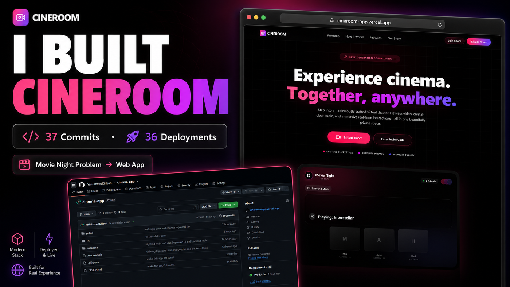
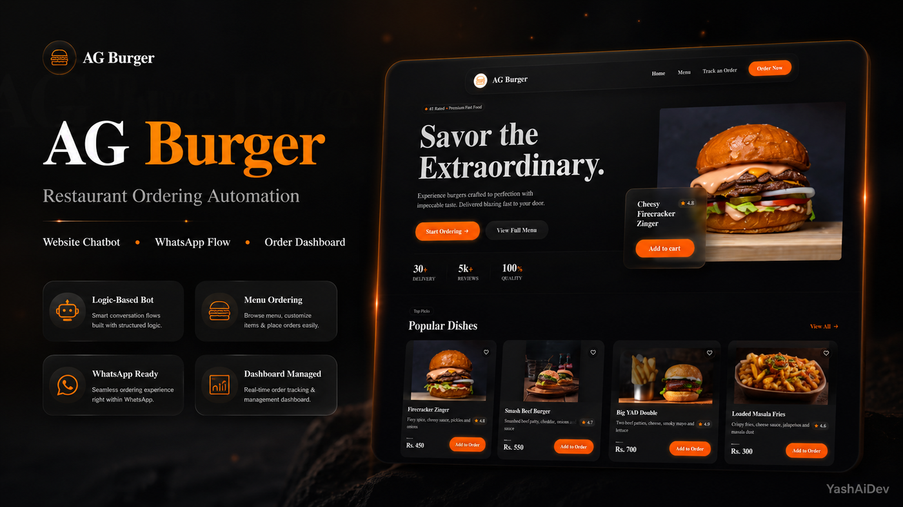

<p align="center">
  
</p>

<p align="center">
  
</p>

<h1 align="center">Yasir Ahmed Ghauri — YashAiDev</h1>

<p align="center">
  <b>AI Systems Architect • Premium Website Builder • Automation Engineer • Full-Stack Developer</b>
</p>

<p align="center">
  I build premium web platforms, AI-powered business systems, automation workflows, dashboards, lead engines, and conversion-focused digital products that help businesses move from messy manual work to clean automated growth.
</p>

<p align="center">
  <a href="https://yashaidev.xinrlabs.com">
    
  </a>
  <a href="mailto:yasirahmedghauri10@gmail.com">
    
  </a>
  <a href="https://github.com/YasirAhmedGHauri">
    
  </a>
  
</p>

<p align="center">
  
</p>

## ⚡ Proof-Backed Builds

<a href="https://cineroom-app.vercel.app">
  
</a>

### 🎬 CineRoom — Private Movie Night Web App

A cinematic watch-party platform built around a real problem: long-distance movie nights should not depend on the painful “3...2...1 press play” countdown.

<p>
  
  
  
  
</p>

**Built for:** private rooms, host controls, invite flow, password access, synced experience, and a premium entertainment UI.

---

<a href="#">
  
</a>

### 🍔 AG Burger — Restaurant Ordering Automation

A restaurant ordering automation concept designed to reduce manual order handling, guide customers through menu choices, support WhatsApp-style flows, and prepare orders for dashboard management.

<p>
  
  
  
  
</p>

**Built for:** website chatbot, WhatsApp order flow, menu browsing, multi-item orders, add-ons, editing, confirmation, and order dashboard logic.

<p align="center">
  
</p>

## 🧠 Premium Systems I Build

<table>
<tr>
<td width="50%">

### AI Systems & Automation

I design intelligent business systems that automate repetitive work, capture leads, qualify users, trigger follow-ups, and connect multiple workflows into one operating system.

</td>
<td width="50%">

### Premium Web Platforms

I build high-conversion websites and full-stack platforms with polished UI, fast performance, clean architecture, and business-focused user journeys.

</td>
</tr>
<tr>
<td width="50%">

### Lead Engines

I create systems that turn cold traffic into qualified opportunities using audits, scraping, enrichment, scoring, and outreach-ready exports.

</td>
<td width="50%">

### Portfolio-Grade Products

I build real-world products that look premium, solve actual problems, and can be presented as strong case studies on GitHub, LinkedIn, and portfolios.

</td>
</tr>
</table>

## 🛠️ Tech Stack

<p align="center">
  
</p>

<p align="center">
  
  
  
  
  
  
  
  
</p>

## 📊 GitHub Performance

<p align="center">
  
  
</p>

<p align="center">
  
</p>

## 📈 Contribution Activity

<p align="center">
  
</p>

## 🐍 Contribution Snake

<p align="center">
  
</p>

## 🚀 Current Focus

```txt
Building premium full-stack products, AI-powered business systems,
automation tools, and real-world portfolio projects that solve actual client problems.
```

<p align="center">
  <a href="https://yashaidev.xinrlabs.com">
    
  </a>
  <a href="mailto:yasirahmedghauri10@gmail.com">
    
  </a>
</p>

<p align="center">
  
</p>

<p align="center">
  <b>YashAiDev</b> — Building systems that look premium, work cleanly, and help businesses grow.
</p>
